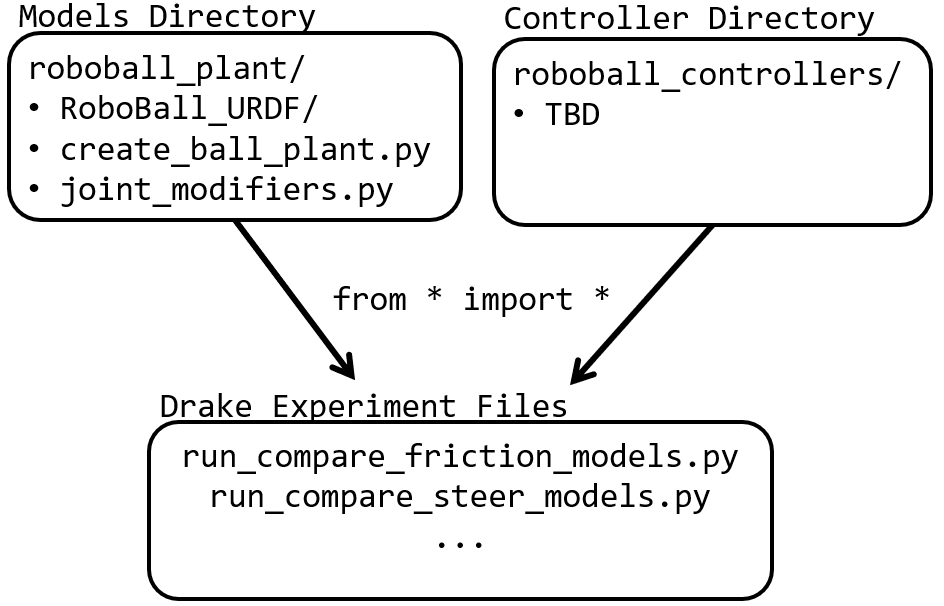

# RoboBall-Drake

This repository contains files that support the tests conducted in this paper

\cite{}

## Environment Setup
'''''' copy from the example repo

## Figure Generation
the following commands will generate plots that are found in the paper

generates the friction model comparison graph

`python3 roboball_plant/joint_modifiers.py`

generates the friction models when implemented on the robot in the steering stand

`python3 run_compare_friction_models.py`

generates the model comparisons in the final section of the paper

`python3 run_compare_steer_models.py`

## Respository outline

`roboball_controllers/` is a directory that will house future controller prototypes to test with the simulated model

`roboball_plant/` contains useful setup scripts to create modular models of the robot
 - `create_ball_plant.py` defines two useful functions:  
    `add_RoboBall_plant()`loads in the robot urdf as a multibody plant in different useful configurations       
    `update_bedliner_properties()` to update the systems hydroelastic contact parameters onthe fly  

`utilities/` contains other non-robot specific features that are used in the paper.

